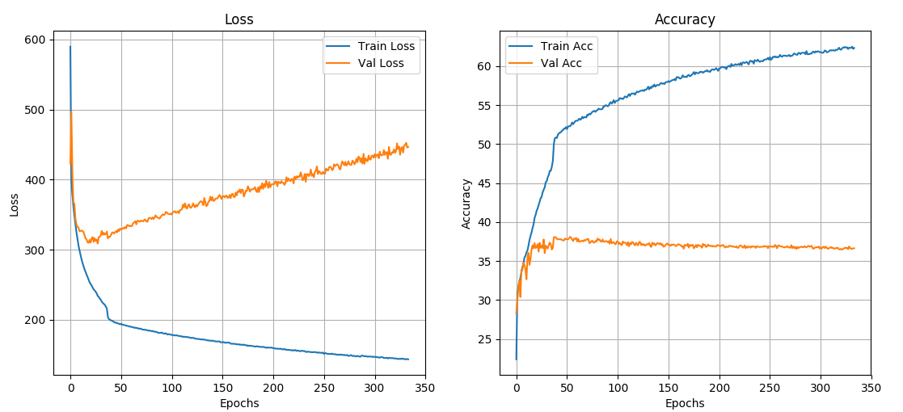

# VQA-PyTorch

## Implementation Details
My implementation of VQA in PyTorch. I have used Balanced Real Images from the [VQA dataset](https://visualqa.org/download.html). Download the annotations and questions and extract it into the data/ folder.  
I have used GloVe embedding (300 dimensional) for modeling the input questions. Download the GloVe embedding from [this](http://nlp.stanford.edu/data/glove.6B.zip) link and extract the file glove.6B.300d.txt into the data folder.  

## Approach
I have only used those images for which the answer appears atleast twice in the dataset. Based on this approach, I have created a list of answers which appear only once in the entire dataset and hance are ignored. These answers are pickled in the list ignore_list.pkl. This helps reduce the vocabulary size which happens to be the dimension of the output vector.  

The CNN I used for feature extraction from iamges is ResNet-18. The input images are resized to 224x224 before feeding into the network. So, I have already extracted the feature vectors for each of those images and dumped it into a pickle file. Download the features from [this](https://www.dropbox.com/sh/2funpz0cf1lx2tu/AACpyUQlj19GJDf-cvwOUhFna?dl=0) link and put it into the dumps/ folder.  

For data augmentation, I have flipped the training images. The image_features.pkl file consists of list of lists in this format: [[feature1, feature2], path, question, answer] where feature1 is the 512 dimensional features vector for that image and feature2 is the feature vector for a 180 degree flipped image. In case of validation data, the val_features.pkl file consists of list of lists in the format: [feature, path, question, answer].  

## Results
I have trained the network for over 300 epochs and it very easily overfits the data. The best validation accurracy I obtained is 38.11%.  
The following figure shows the learning curves I got:  

  

