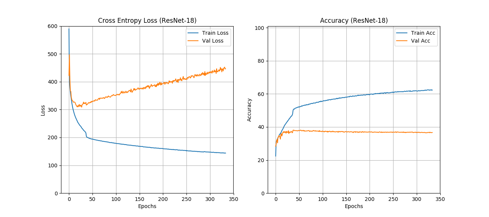

# VQA-PyTorch

## Implementation Details
My implementation of VQA in PyTorch. I have used Balanced Real Images from the [VQA dataset](https://visualqa.org/download.html). Download the annotations and questions and extract it into the data/ folder.  
I have used GloVe embedding (300 dimensional) for modeling the input questions. Download the GloVe embedding from [this](http://nlp.stanford.edu/data/glove.6B.zip) link and extract the file glove.6B.300d.txt into the data folder.  

## Approach
I have only used those images for which the answer appears atleast twice in the dataset. Based on this approach, I have created a list of answers which appear only once in the entire dataset and hance are ignored. These answers are pickled in the list ignore_list.pkl. This helps reduce the vocabulary size which happens to be the dimension of the output vector.  

The CNN I used for feature extraction from iamges is ResNet-18. The input images are resized to 224x224 before feeding into the network. So, I have already extracted the feature vectors for each of those images and dumped it into a pickle file. Download the features from [this](https://www.dropbox.com/sh/2funpz0cf1lx2tu/AACpyUQlj19GJDf-cvwOUhFna?dl=0) link and put it into the dumps/ folder.  

For data augmentation, I have flipped the training images. The image_features.pkl file consists of list of lists in this format: [[feature1, feature2], path, question, answer] where feature1 is the 512 dimensional features vector for that image and feature2 is the feature vector for a 180 degree flipped image. In case of validation data, the val_features.pkl file consists of list of lists in the format: [feature, path, question, answer].  

I used an LSTM which has 2 layers each with 64 hidden units. 

### Approach 1.1
The image features (512 dimensional) is passed through a ense layers to reduce it to a dimension of 256. The output from LSTM model is also passed through a dense layer to make it of dimension 256. These 2 feature vectors were **concatenated** before feeding them to a dense layer of dimension equal to the vocabulary size. The output is passed through softmax for classification. This did not give very good results and the validation accuracy was stuck at 29%.  

### Approach 1.2
One reason for the low accuracy was that the 256 dimensional feature vectors extracted from both the image and the question were having different distributions (mean and variances). So I applied a BatchNorm to each of the features before concatenation. This increased the accuracy to 33%.  

### Approach 1.3
Another alternative I tried was to **multiply** the features instead of cancatenating them. So now the 2 feature vectors of 256 dimension are multiplied element-wise which gives a validation accuracy of 38%.  

## Results
I have trained the network for over 300 epochs and it very easily overfits the data. The best validation accurracy I obtained is **38.11%**.  
The following figure shows the learning curves I got:  

  

Following are few examples of images from the validation set:  

  

Q: What is the dog doing?  
A: running  

  

Q: What is in the image?  
A: cat  

Q: Where is this picture taken?  
A: mountain  

Q: What animal is shown in the picture?  
A: eleph  

  

Q: What food is this?  
A: pizza  

Q: What is the stuffing?  
A: ketchup  

Q: What bread is used?  
A: wheat

### Approach 2.1
The [original paper](https://arxiv.org/abs/1505.00468) mentions the architecture which uses 2 LSTM layers with 512 hidden units. The hidden state and the the internal state of the 2 LSTM cells are flattened and concatenated to obtain a layer of 2048 dimensions. The dimensionaltity of these layers is then reduced to 1024 by passing it through a dense layer. The image features are now extracted from VGG16 pretrained model. The output features vector from VGG16 is of dimension 4096. This is also reduced to 1024 by passing it through a dense layer. The 2 feature vectors (1024 dimension each) are merged by element-wise multiplication after batch-notrmalization. These are then passed through 2 more dense layers of 1024 dimension each. tanh non-linearity is used everywhere and dropout is set to 0.6. The final dense layer has dimensions matching the size of unique answers in the training dataset. Softmax activation is used and the model is trained with cross-entropy loss.

## Results
The following are the results obtained with the new architecture trained for 160 epochs. The model gives best validation accuracy of **57%**:  

  

Some examples from the validation set are:

  

Q: What animal is shown?  
A: horse  

Q: is that water behind the horse?  
A: ye  

Q: How many horses are there?  
A: 1

  

Q: What is in the background?  
A: '<unk>' (unknown)

Q: What color is the vase?  
A: white  

  

Q: What time of day is this?  
A: '<unk>'  

Q: What is in the air?  
A: kite  

Q: Where is this picture taken?  
A: beach  
